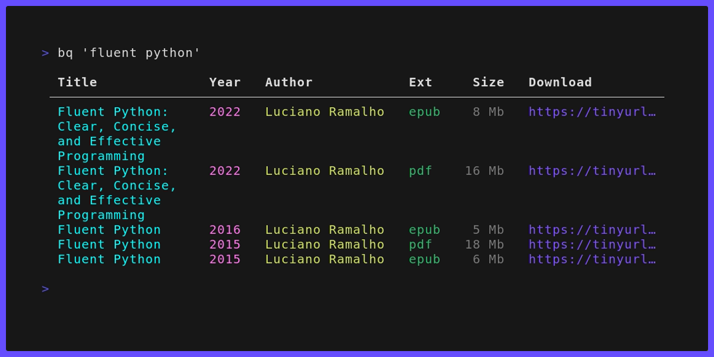

# bq


`bq` is a CLI tool for searching and downloading eBooks.

<p align="center">
  
</p>

### Installation

> **Required**:
> - Python 3.10+
> - [pipx](https://github.com/pypa/pipxs)
> - [uv](https://github.com/astral-sh/uv)

Clone project and install:

```sh
git clone https://github.com/jgafnea/bq && cd bq
uv install
pipx install .
```

### Usage

Search book titles and click links to download:

```sh
bq "fluent python"

 Title            Year   Author            Ext     Size   Download                      
 ───────────────────────────────────────────────────────────────────────────────────── 
  Fluent Python   2022   Luciano Ramalho   epub    8 Mb   https://tinyurl.com/2crvr473
```
